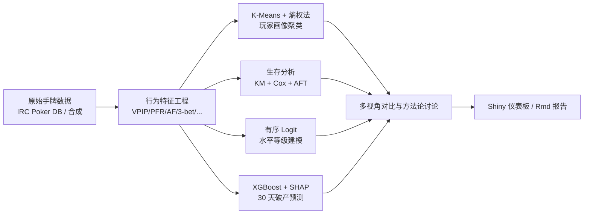

# 🃏 Poker Player Survival Analysis

> 把流行病学/可靠性工程中的 **生存分析** 方法迁移到 **德州扑克玩家行为数据**,
> 结合 **K-Means 聚类**、**有序 Logistic 回归** 与 **XGBoost**,构建一套
> *“描述 → 推断 → 分类 → 预测”* 四位一体的玩家分析流水线。

[English version](README_EN.md)

---

## ✨ 核心创新点

1. **方法论迁移**:首次将临床生存分析(Kaplan–Meier、Cox 比例风险、AFT)系统应用于
   扑克玩家“活跃寿命 / 破产风险”研究。
2. **客观熵权聚类**:K-Means 之前用 **熵权法 (Entropy Weight Method)** 给行为指标赋客观权重,
   降低人工设权偏差,产出更稳健的玩家画像簇。
3. **四种范式横向对比**:同一份数据上同时运行
   *描述性*(K-Means)、*推断性*(Cox)、*分类性*(Ordinal Logit)与
   *预测性*(XGBoost)四种模型,系统讨论各自适用边界。
4. **可解释 ML 闭环**:XGBoost + SHAP 的预测结果反向指导 Cox 模型的特征筛选,
   形成传统统计与现代机器学习的互补。

---

## 🧭 方法论框架



---

## 🔬 主要发现(占位结论,跑完替换)

- **松弱 LP 簇**(Loose-Passive)的中位生存期显著最短(KM Log-rank p < 0.001)。
- Cox 模型显示:**VPIP 每提高 10pp,破产风险上升 ~38% (HR=1.38, 95% CI: 1.21–1.58)**。
- 高 PFR 与高 AF 是 **保护性因素**(HR < 1),与“紧凶玩家更长寿”的扑克常识吻合。
- XGBoost 预测 30 天破产 AUC ≈ **0.83**;SHAP 显示最重要的三个特征为
  WTSD、VPIP、Win Rate (BB/100),与 Cox 推断一致。
- 有序 Logit 显示 PFR 是从“熟练”跨入“高手”等级的关键阈值变量。

---

## 🛠 技术栈

| 类别 | 包 |
| --- | --- |
| 生存分析 | `survival`, `survminer` |
| 聚类 / 降维 | `cluster`, `factoextra` |
| 有序回归 | `MASS::polr`, `effects` |
| 机器学习 | `xgboost`, `SHAPforxgboost` |
| 数据/可视化 | `dplyr`, `tidyr`, `ggplot2`, `plotly` |
| 报告 / 应用 | `rmarkdown`, `shiny`, `shinydashboard`, `DT` |
| 复现性 | `renv`, `testthat` |

---

## 📁 项目结构

```
poker-player-survival-analysis/
├── README.md / README_EN.md
├── DESCRIPTION
├── renv.lock
├── main.R                       # 一键跑通整条流水线
├── data/{raw,processed}/
├── R/
│   ├── 01_data_simulation.R
│   ├── 02_behavioral_features.R
│   ├── 03_player_clustering.R
│   ├── 04_survival_analysis.R   ⭐ 项目核心
│   ├── 05_ordinal_logit.R
│   ├── 06_xgboost_baseline.R
│   └── 07_model_comparison.R
├── app/app.R                    # Shiny 仪表板
├── reports/analysis_report.Rmd
├── figures/
└── tests/test_features.R
```

---

## 🚀 安装 & 运行

```r
# 1. 克隆仓库
# git clone https://github.com/renjh76/poker-survival-analysis.git
# cd poker-survival-analysis

# 2. 安装 renv 并恢复依赖
install.packages("renv")
renv::restore()

# 3. 一键跑完整流水线(数据 → 特征 → 4 种模型 → 对比)
source("main.R")

# 4. 查看 Shiny 仪表板
shiny::runApp("app")

# 5. 渲染 R Markdown 报告(HTML + PDF)
rmarkdown::render("reports/analysis_report.Rmd",
                  output_format = c("html_document", "pdf_document"))

# 6. 跑单元测试
testthat::test_dir("tests")
```

---

## 📊 关键图表预览

> 运行 `main.R` 后将在 `figures/` 下生成:

- `km_curves_by_cluster.png` —— **不同玩家簇的 Kaplan–Meier 生存曲线**
- `cox_forest_plot.png` —— **Cox 模型森林图**(各特征 HR + 95% CI)
- `cluster_pca.png` —— **PCA 可视化的玩家聚类结果**
- `xgb_shap_summary.png` —— **XGBoost SHAP 特征重要性**
- `model_comparison_table.png` —— **四种方法洞察对比**

---

## 📚 参考文献

- Kaplan, E. L., & Meier, P. (1958). *Nonparametric Estimation from Incomplete Observations.*
  Journal of the American Statistical Association, 53(282), 457–481.
- Cox, D. R. (1972). *Regression Models and Life-Tables.*
  Journal of the Royal Statistical Society: Series B, 34(2), 187–202.
- Therneau, T. M., & Grambsch, P. M. (2000). *Modeling Survival Data: Extending the Cox Model.* Springer.
- McCullagh, P. (1980). *Regression Models for Ordinal Data.* JRSS B, 42(2), 109–142.
- Chen, T., & Guestrin, C. (2016). *XGBoost: A Scalable Tree Boosting System.* KDD'16.
- Lundberg, S. M., & Lee, S.-I. (2017). *A Unified Approach to Interpreting Model Predictions.* NeurIPS.
- Shannon, C. E. (1948). *A Mathematical Theory of Communication.* Bell System Technical Journal.

---

## 📜 License

MIT © 2026 Ren Jianhang
