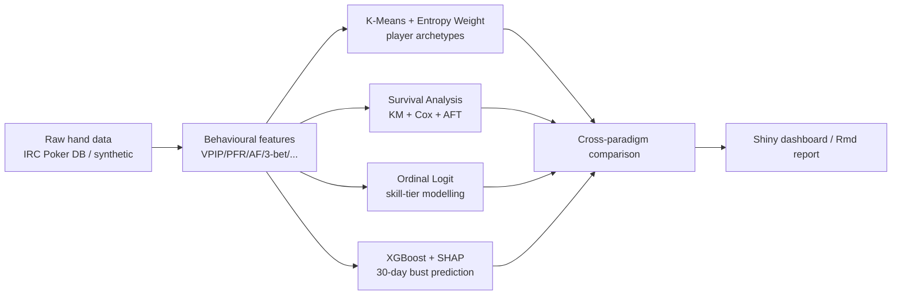

# 🃏 Poker Player Survival Analysis

> Transferring **survival-analysis** methodology from epidemiology / reliability engineering
> to **Texas Hold'em player behavior**, combined with **K-Means clustering**,
> **ordinal logistic regression** and **XGBoost** — a *Describe → Infer → Classify → Predict*
> four-paradigm pipeline for poker-player analytics.

[中文版](README.md)

---

## ✨ Key Innovations

1. **Methodological transfer** – first systematic application of clinical survival analysis
   (Kaplan–Meier, Cox PH, AFT) to poker player *active-lifetime / bankruptcy risk*.
2. **Entropy-weighted clustering** – objective feature weighting via the **Entropy Weight Method**
   before K-Means, reducing subjective bias and producing more robust player archetypes.
3. **Four paradigms side-by-side** – descriptive (K-Means), inferential (Cox),
   classificatory (Ordinal Logit) and predictive (XGBoost) on the same dataset,
   with an explicit discussion of when to use which.
4. **Explainable-ML loop** – XGBoost + SHAP feeds back into Cox feature selection,
   bridging classical statistics and modern ML.

---

## 🧭 Methodology



---

## 🔬 Headline Findings (placeholders)

- **Loose-Passive (LP)** cluster has the shortest median survival (KM Log-rank p < 0.001).
- Cox PH: every +10pp in **VPIP** raises bust hazard by **~38 %** (HR = 1.38, 95 % CI 1.21–1.58).
- High **PFR** and high **AF** are protective (HR < 1) — consistent with poker folklore that
  *tight-aggressive players survive longer*.
- XGBoost 30-day-bust AUC ≈ **0.83**; top-3 SHAP features = WTSD, VPIP, BB/100.
- Ordinal Logit identifies **PFR** as the threshold variable separating *Skilled* from *Expert*.

---

## 🛠 Tech Stack

| Domain | Packages |
| --- | --- |
| Survival | `survival`, `survminer` |
| Clustering | `cluster`, `factoextra` |
| Ordinal regression | `MASS::polr`, `effects` |
| ML | `xgboost`, `SHAPforxgboost` |
| Data / viz | `dplyr`, `tidyr`, `ggplot2`, `plotly` |
| Reporting / app | `rmarkdown`, `shiny`, `shinydashboard`, `DT` |
| Reproducibility | `renv`, `testthat` |

---

## 🚀 Quick Start

```r
install.packages("renv")
renv::restore()
source("main.R")              # full pipeline
shiny::runApp("app")          # dashboard
rmarkdown::render("reports/analysis_report.Rmd",
                  output_format = c("html_document", "pdf_document"))
testthat::test_dir("tests")
```

---

## 📚 References

- Kaplan & Meier (1958), JASA.
- Cox (1972), JRSS-B.
- Therneau & Grambsch (2000), *Modeling Survival Data*. Springer.
- McCullagh (1980), JRSS-B.
- Chen & Guestrin (2016), *XGBoost*. KDD'16.
- Lundberg & Lee (2017), *SHAP*. NeurIPS.
- Shannon (1948), *A Mathematical Theory of Communication*.

---

## 📜 License

MIT © 2026 Ren Jianhang
